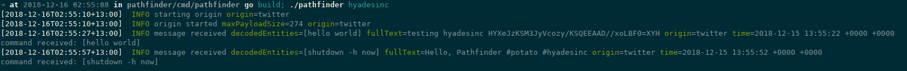

# Pathfinder

This program is a Pathfinder.

What this means is that it's going to listen for messages hidden in several different sources, and maybe act upon them.

This can be useful to bypass censorship, or maybe something else.

You can use keywords (`TagMap`) or embed arbitrary data with the included `packer` util.

# Disclaimer

This project is meant for *EDUCATIONAL PURPOSES ONLY*.

Don't use it for illegal activities.

You are the sole responsible for your actions.

## Getting Started

See the example on [cmd/pathfinder](https://github.com/kamushadenes/pathfinder/cmd/pathfinder/main.go)

### Usage

`./pathfinder <CUE>`

### Example



### Prerequisites

- Go 1.10
- Twitter OAUTH

### Installing

First, download the project to your GOPATH

```
go get -u github.com/kamushadenes/pathfinder
```

Then build the binary (or see below to run it properly with Docker)

```bash
cd $GOPATH/github.com/kamushadenes/pathfinder
cd cmd/pathfinder
go build
```

## Running the tests

```
go test -v
```

### Benchmark

```
go test -v -bench=.
```

## Running

Set the following environment variables, and change them accordingly:

```
TWITTER_CONSUMER_KEY=xxxx
TWITTER_CONSUMER_SECRET=xxxx
TWITTER_ACCESS_TOKEN=xxx
TWITTER_ACCESS_SECRET=xxx
```

## Roadmap

- Instagram
- Facebook
- YouTube
- Pinterest
- Pastebin
- ???

## Contributing

Please read [CONTRIBUTING.md](CONTRIBUTING.md) for details on our code of conduct, and the process for submitting pull requests to us.

## Versioning

We use [SemVer](http://semver.org/) for versioning. For the versions available, see the [tags on this repository](https://github.com/your/project/tags).

## Authors

* **Kamus Hadenes** - *Main work* - [kamushadenes](https://github.com/kamushadenes)

## License

This project is licensed under the MIT License - see the [LICENSE.md](LICENSE.md) file for details